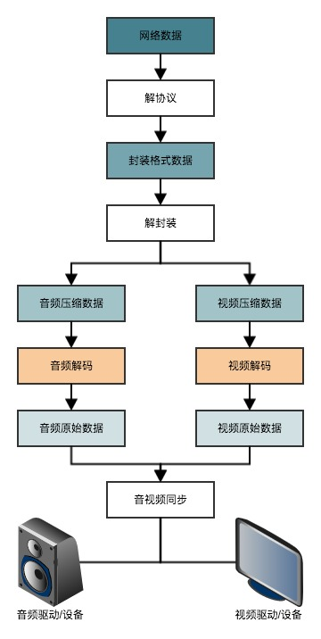

## 通用视频解码播放流程

**通用的网络视频播放流程:**

1. 从网络数据流中获得视频数据流。
2. 将视频数据流解析成压缩音频数据和压缩视频数据。
3. 分别对音频和视频解码获取原始(采样)数据。
4. 经过同步策略后，有序的将原始(采样)数据输出到指定设备播放。

### 参考资料：

[视音频编解码技术零基础学习方法](http://blog.csdn.net/leixiaohua1020/article/details/18893769)