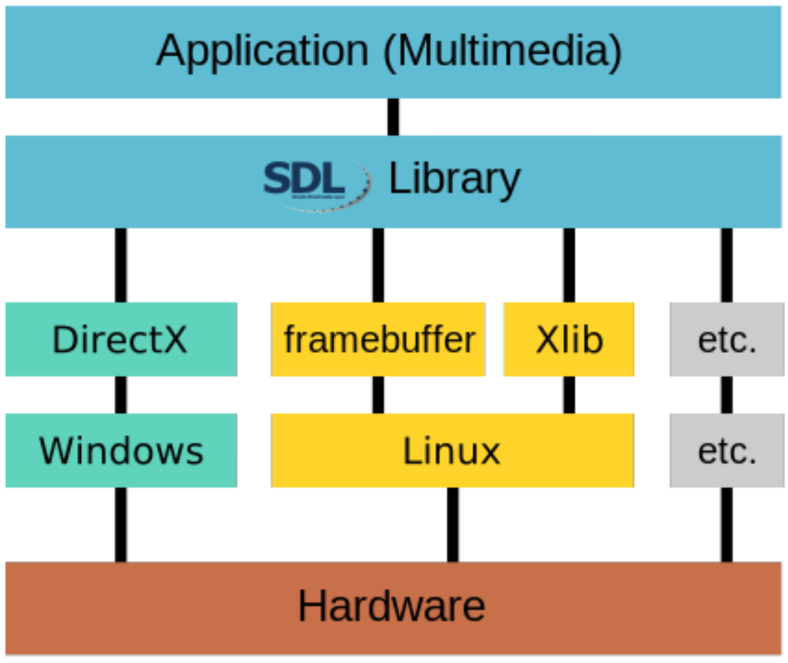
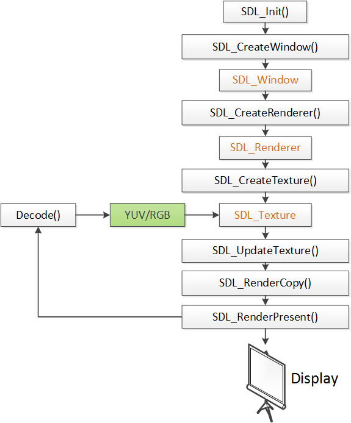
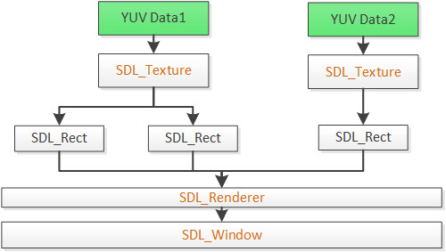

## SDL

### 简介

SDL（Simple DirectMedia Layer）库的作用就是封装了复杂的音视频底层交互工作，简化了音视频处理的难度。

**特点：** 开源、跨平台。

### 结构

它是对底层进行了封装，最终还是调用的平台底层接口与硬件进行交互。

### SDL 流程

### SDL 主要函数

| 函数                 | 简介                       |
| -------------------- | -------------------------- |
| SDL_Init()           | 初始化 SDL 系统。          |
| SDL_CreateWindow()   | 创建窗口 SDL_Window。      |
| SDL_CreateRenderer() | 创建渲染器 SDL_Renderer。  |
| SDL_CreateTexture()  | 创建纹理 SDL_Texture。     |
| SDL_UpdateTexture()  | 设置纹理数据。             |
| SDL_RenderCopy()     | 将纹理的数据拷贝给渲染器。 |
| SDL_RenderPresent()  | 显示。                     |
| SDL_Delay()          | 工具函数，用于延时。       |
| SDL_Quit()           | 退出 SDL 系统。            |

### SDL 数据结构

**数据结构简介：**

| 结构         | 简介                 |
| ------------ | -------------------- |
| SDL_Window   | 代表一个“窗口”。     |
| SDL_Renderer | 代表一个“渲染器”。   |
| SDL_Texture  | 代表一个“纹理”。     |
| SDL_Rect     | 一个简单的矩形结构。 |

### SDL 事件和多线程

#### **SDL 多线程**

| 函数               | 简介           |
| ------------------ | -------------- |
| SDL_CreateThread() | 创建一个线程。 |
| SDL_Thread()       | 线程的句柄。   |

#### **SDL 事件**

**函数：**

| 函数            | 简介           |
| --------------- | -------------- |
| SDL_WaitEvent() | 等待一个事件。 |
| SDL_PushEvent() | 发送一个事件。 |

**数据结构：**

| 结构        | 简介           |
| ----------- | -------------- |
| SDL_Event() | 代表一个事件。 |

