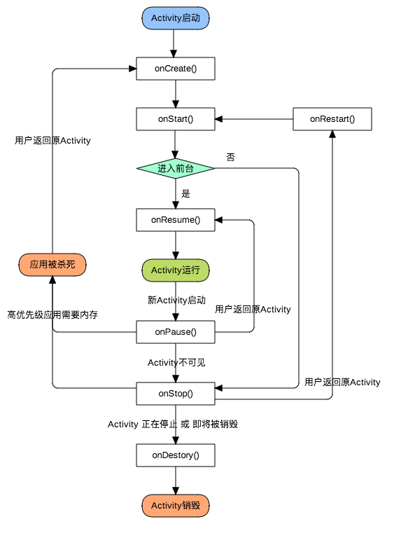

# Activity生命周期

## 生命周期状态转换示意图(完整版)

## 典型情况下的生命周期

<table width="85%" align="center" rules="rows">
     <colgroup align="left" span="3" />
     <colgroup align="left" />
     <colgroup align="center" />
     <colgroup align="center" />

     <thead>
     <tr><th colspan="3">方法</th> <th>描述</th> <th>允许被杀死?</th> <th>接下来的方法</th></tr>
     </thead>

     <tbody>
     <tr><td colspan="3" align="left" border="0"><code><a href="https://developer.android.com/reference/android/app/Activity.html#onCreate(android.os.Bundle)">onCreate()</a></code></td>
         <td>当Activity第一次被创建时调用.
             在这里进行初始化工作: 创建view, 为list绑定数据 等。 
             如果Activity被杀死后重新初始化，你可以在savedInstanceState中得到被杀死之前				的某些状态信息。</td>
         <td align="center">不允许</td>
         <td align="center"><code>onStart()</code></td>
     </tr>

     <tr><td rowspan="5" style="border-left: none; border-right: none;">&nbsp;&nbsp;&nbsp;&nbsp;</td>
         <td colspan="2" align="left" border="0"><code><a href="https://developer.android.com/reference/android/app/Activity.html#onRestart()">onRestart()</a></code></td>
         <td>当Activity切换到后台再切换回来时会被调用。</td>
         <td align="center">不允许</td>
         <td align="center"><code>onStart()</code></td>
     </tr>

     <tr><td colspan="2" align="left" border="0"><code><a href="https://developer.android.com/reference/android/app/Activity.html#onStart()">onStart()</a></code></td>
         <td>当Activity对用户可见时调用。

             
如果Activity进入前台则接下来调用<code>onResume()</code> 如果Activity被隐藏则接下来调用<code>onStop()</code> </td>
         <td align="center">不允许</td>
         <td align="center"><code>onResume()</code>  或者  <code>onStop()</code></td>
     </tr>

     <tr><td rowspan="2" style="border-left: none;">&nbsp;&nbsp;&nbsp;&nbsp;</td>
         <td align="left" border="0"><code><a href="https://developer.android.com/reference/android/app/Activity.html#onResume()">onResume()</a></code></td>
         <td>当Activity可以与用户交互时调用.此时当前Activity处于Activity栈的顶端。</td>
         <td align="center">不允许</td>
         <td align="center"><code>onPause()</code></td>
     </tr>

     <tr><td align="left" border="0"><code><a href="https://developer.android.com/reference/android/app/Activity.html#onPause()">onPause()</a></code></td>
         <td>当启动一个新的界面时调用，表示当前Activity正在停止。
           	可以在这个方法中保存一些数据，停止动画和一些其他操作，可能会占用大量CPU。不能在这个方法中执行耗时操作，因为只有这个方法执行后才会执行新Activity的<code>onResume()</code>。              如果快速返回当前Activity则会执行<code>onResume()</code>，如果新Activity启动完成则接着执行<code>onStop()</code></td>
         <td align="center"><strong><code><a href="https://developer.android.com/reference/android/os/Build.VERSION_CODES.html#HONEYCOMB">HONEYCOMB</a></code>之前</strong></td>
         <td align="center"><code>onResume()</code> 或者 
                 <code>onStop()</code></td>
     </tr>

     <tr><td colspan="2" align="left" border="0"><code><a href="https://developer.android.com/reference/android/app/Activity.html#onStop()">onStop()</a></code></td>
         <td>当Activity对用户不可见时调用，此时新的Activity已经启动完成并遮挡了该界面。此时可做清廉几回手工作，同样不要太耗时。
             
如果之后返回当前Activity则接着调用 <code>onRestart()</code>, 或者被销毁调用<code>onDestroy()</code>。</td>
         <td align="center"><strong>允许</strong></td>
         <td align="center"><code>onRestart()</code> 或者 
                 <code>onDestroy()</code></td>
     </tr>

     <tr><td colspan="3" align="left" border="0"><code><a href="https://developer.android.com/reference/android/app/Activity.html#onDestroy()">onDestroy()</a></code></td>
         <td>Activity被销毁时调用的最后一个函数.  可能是因为 <code><a href="https://developer.android.com/reference/android/app/Activity.html#finish()">finish()</a></code> 方法被调用，或者是系统回收资源释放空间。你可以用 <code><a href="https://developer.android.com/reference/android/app/Activity.html#isFinishing()">isFinishing()</a></code> 方法用于区分是哪种情况。 可以在这个方法中进行最后的回收工作与资源释放。</td>
         <td align="center"><strong>允许</strong></td>
         <td align="center"><em>无</em></td>
     </tr>
     </tbody>
</table>
